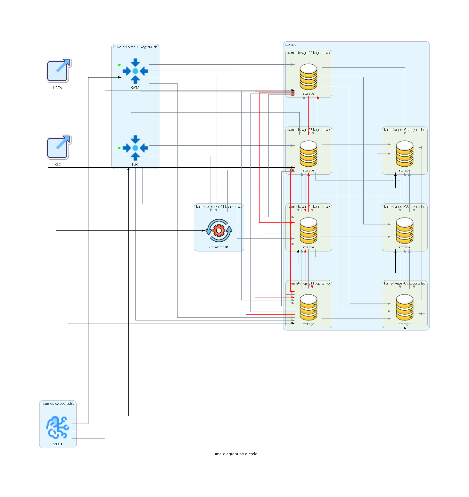

# Аппаратное обеспечение

| №  | Имя сервера                    | IP адрес сервера | Процессор                                        | ОЗУ     | Диск      |
| -- | ------------------------------ | ---------------- |--------------------------------------------------|---------|-----------|
| 1  | kuma-core.kogorta.lab          | 192.168.76.50    | 2 CPU, Intel(R) Xeon(R) CPU E5-2697 v2 @ 2.70GHz | 4.00 GB | 20.00 GB  |
| 2  | kuma-collector-01.kogorta.lab  | 192.168.76.51    | 2 CPU, Intel(R) Xeon(R) CPU E5-2697 v2 @ 2.70GHz | 4.00 GB | 20.00 GB  |
| 3  | kuma-collector-02.kogorta.lab  | 192.168.76.52    | 2 CPU, Intel(R) Xeon(R) CPU E5-2697 v2 @ 2.70GHz | 4.00 GB | 20.00 GB  |
| 4  | kuma-correlator-01.kogorta.lab | 192.168.76.53    | 2 CPU, Intel(R) Xeon(R) CPU E5-2697 v2 @ 2.70GHz | 4.00 GB | 20.00 GB  |
| 5  | kuma-storage-01.kogorta.lab    | 192.168.76.57    | 4 CPU, Intel(R) Xeon(R) CPU E5-2697 v2 @ 2.70GHz | 8.00 GB | 200.00 GB |
| 6  | kuma-storage-02.kogorta.lab    | 192.168.76.58    | 4 CPU, Intel(R) Xeon(R) CPU E5-2697 v2 @ 2.70GHz | 8.00 GB | 200.00 GB |
| 7  | kuma-storage-03.kogorta.lab    | 192.168.76.59    | 2 CPU, Intel(R) Xeon(R) CPU E5-2697 v2 @ 2.70GHz | 3642 MB | 20.00 GB  |
| 8  | kuma-storage-04.kogorta.lab    | 192.168.76.60    | 2 CPU, Intel(R) Xeon(R) CPU E5-2697 v2 @ 2.70GHz | 3642 MB | 20.00 GB  |
| 9  | kuma-keeper-01.kogorta.lab     | 192.168.76.54    | 2 CPU, Intel(R) Xeon(R) CPU E5-2697 v2 @ 2.70GHz | 3642 MB | 20.00 GB  |
| 10 | kuma-keeper-02.kogorta.lab     | 192.168.76.55    | 2 CPU, Intel(R) Xeon(R) CPU E5-2697 v2 @ 2.70GHz | 3642 MB | 20.00 GB  |
| 11 | kuma-keeper-03.kogorta.lab     | 192.168.76.56    | 2 CPU, Intel(R) Xeon(R) CPU E5-2697 v2 @ 2.70GHz | 3642 MB | 20.00 GB  |

# Средства и способы межсетевого взаимодействия компонентов Системы

| Источник      | Имя сервера источника          | IP адрес источника | Назначение    | Имя сервера назначния          | IP адрес назначения | Порт назначения | Протокол |
| ------------- | ------------------------------ | ------------------ | ------------- | ------------------------------ | ------------------- | --------------- | -------- |
| KSC           | kuma-collector-01.kogorta.lab  | 192.168.76.51      | correlator-01 | kuma-correlator-01.kogorta.lab | 192.168.76.53       | 7221            | TCP      |
| KSC           | kuma-collector-01.kogorta.lab  | 192.168.76.51      | storage       | kuma-storage-01.kogorta.lab    | 192.168.76.57       | 7221            | TCP      |
| KSC           | kuma-collector-01.kogorta.lab  | 192.168.76.51      | storage       | kuma-storage-02.kogorta.lab    | 192.168.76.58       | 7221            | TCP      |
| KSC           | kuma-collector-01.kogorta.lab  | 192.168.76.51      | storage       | kuma-storage-03.kogorta.lab    | 192.168.76.59       | 7221            | TCP      |
| KSC           | kuma-collector-01.kogorta.lab  | 192.168.76.51      | storage       | kuma-storage-04.kogorta.lab    | 192.168.76.60       | 7221            | TCP      |
| core-1        | kuma-core.kogorta.lab          | 192.168.76.50      | KSC           | kuma-collector-01.kogorta.lab  | 192.168.76.51       | 7221            | TCP      |
| core-1        | kuma-core.kogorta.lab          | 192.168.76.50      | correlator-01 | kuma-correlator-01.kogorta.lab | 192.168.76.53       | 7221            | TCP      |
| core-1        | kuma-core.kogorta.lab          | 192.168.76.50      | storage       | kuma-storage-02.kogorta.lab    | 192.168.76.58       | 7221            | TCP      |
| core-1        | kuma-core.kogorta.lab          | 192.168.76.50      | storage       | kuma-storage-03.kogorta.lab    | 192.168.76.59       | 7221            | TCP      |
| core-1        | kuma-core.kogorta.lab          | 192.168.76.50      | storage       | kuma-storage-04.kogorta.lab    | 192.168.76.60       | 7221            | TCP      |
| core-1        | kuma-core.kogorta.lab          | 192.168.76.50      | storage       | kuma-keeper-01.kogorta.lab     | 192.168.76.54       | 7221            | TCP      |
| core-1        | kuma-core.kogorta.lab          | 192.168.76.50      | storage       | kuma-keeper-02.kogorta.lab     | 192.168.76.55       | 7221            | TCP      |
| core-1        | kuma-core.kogorta.lab          | 192.168.76.50      | storage       | kuma-keeper-03.kogorta.lab     | 192.168.76.56       | 7221            | TCP      |
| core-1        | kuma-core.kogorta.lab          | 192.168.76.50      | storage       | kuma-storage-01.kogorta.lab    | 192.168.76.57       | 7221            | TCP      |
| correlator-01 | kuma-correlator-01.kogorta.lab | 192.168.76.53      | storage       | kuma-storage-01.kogorta.lab    | 192.168.76.57       | 7221            | TCP      |
| correlator-01 | kuma-correlator-01.kogorta.lab | 192.168.76.53      | storage       | kuma-storage-02.kogorta.lab    | 192.168.76.58       | 7221            | TCP      |
| correlator-01 | kuma-correlator-01.kogorta.lab | 192.168.76.53      | storage       | kuma-storage-03.kogorta.lab    | 192.168.76.59       | 7221            | TCP      |
| correlator-01 | kuma-correlator-01.kogorta.lab | 192.168.76.53      | storage       | kuma-storage-04.kogorta.lab    | 192.168.76.60       | 7221            | TCP      |
| storage       | kuma-storage-02.kogorta.lab    | 192.168.76.58      | storage       | kuma-keeper-01.kogorta.lab     | 192.168.76.54       | 2181            | TCP      |
| storage       | kuma-storage-02.kogorta.lab    | 192.168.76.58      | storage       | kuma-keeper-02.kogorta.lab     | 192.168.76.55       | 2181            | TCP      |
| storage       | kuma-storage-02.kogorta.lab    | 192.168.76.58      | storage       | kuma-keeper-03.kogorta.lab     | 192.168.76.56       | 2181            | TCP      |
| storage       | kuma-storage-02.kogorta.lab    | 192.168.76.58      | storage       | kuma-storage-03.kogorta.lab    | 192.168.76.59       | 9000            | TCP      |
| storage       | kuma-storage-02.kogorta.lab    | 192.168.76.58      | storage       | kuma-storage-03.kogorta.lab    | 192.168.76.59       | 9009            | TCP      |
| storage       | kuma-storage-02.kogorta.lab    | 192.168.76.58      | storage       | kuma-storage-04.kogorta.lab    | 192.168.76.60       | 9000            | TCP      |
| storage       | kuma-storage-02.kogorta.lab    | 192.168.76.58      | storage       | kuma-storage-04.kogorta.lab    | 192.168.76.60       | 9009            | TCP      |
| storage       | kuma-storage-02.kogorta.lab    | 192.168.76.58      | storage       | kuma-storage-01.kogorta.lab    | 192.168.76.57       | 9000            | TCP      |
| storage       | kuma-storage-02.kogorta.lab    | 192.168.76.58      | storage       | kuma-storage-01.kogorta.lab    | 192.168.76.57       | 9009            | TCP      |
| storage       | kuma-storage-03.kogorta.lab    | 192.168.76.59      | storage       | kuma-keeper-01.kogorta.lab     | 192.168.76.54       | 2181            | TCP      |
| storage       | kuma-storage-03.kogorta.lab    | 192.168.76.59      | storage       | kuma-keeper-02.kogorta.lab     | 192.168.76.55       | 2181            | TCP      |
| storage       | kuma-storage-03.kogorta.lab    | 192.168.76.59      | storage       | kuma-keeper-03.kogorta.lab     | 192.168.76.56       | 2181            | TCP      |
| storage       | kuma-storage-03.kogorta.lab    | 192.168.76.59      | storage       | kuma-storage-02.kogorta.lab    | 192.168.76.58       | 9000            | TCP      |
| storage       | kuma-storage-03.kogorta.lab    | 192.168.76.59      | storage       | kuma-storage-02.kogorta.lab    | 192.168.76.58       | 9009            | TCP      |
| storage       | kuma-storage-03.kogorta.lab    | 192.168.76.59      | storage       | kuma-storage-04.kogorta.lab    | 192.168.76.60       | 9000            | TCP      |
| storage       | kuma-storage-03.kogorta.lab    | 192.168.76.59      | storage       | kuma-storage-04.kogorta.lab    | 192.168.76.60       | 9009            | TCP      |
| storage       | kuma-storage-03.kogorta.lab    | 192.168.76.59      | storage       | kuma-storage-01.kogorta.lab    | 192.168.76.57       | 9000            | TCP      |
| storage       | kuma-storage-03.kogorta.lab    | 192.168.76.59      | storage       | kuma-storage-01.kogorta.lab    | 192.168.76.57       | 9009            | TCP      |
| storage       | kuma-storage-04.kogorta.lab    | 192.168.76.60      | storage       | kuma-keeper-01.kogorta.lab     | 192.168.76.54       | 2181            | TCP      |
| storage       | kuma-storage-04.kogorta.lab    | 192.168.76.60      | storage       | kuma-keeper-02.kogorta.lab     | 192.168.76.55       | 2181            | TCP      |
| storage       | kuma-storage-04.kogorta.lab    | 192.168.76.60      | storage       | kuma-keeper-03.kogorta.lab     | 192.168.76.56       | 2181            | TCP      |
| storage       | kuma-storage-04.kogorta.lab    | 192.168.76.60      | storage       | kuma-storage-02.kogorta.lab    | 192.168.76.58       | 9000            | TCP      |
| storage       | kuma-storage-04.kogorta.lab    | 192.168.76.60      | storage       | kuma-storage-02.kogorta.lab    | 192.168.76.58       | 9009            | TCP      |
| storage       | kuma-storage-04.kogorta.lab    | 192.168.76.60      | storage       | kuma-storage-03.kogorta.lab    | 192.168.76.59       | 9000            | TCP      |
| storage       | kuma-storage-04.kogorta.lab    | 192.168.76.60      | storage       | kuma-storage-03.kogorta.lab    | 192.168.76.59       | 9009            | TCP      |
| storage       | kuma-storage-04.kogorta.lab    | 192.168.76.60      | storage       | kuma-storage-01.kogorta.lab    | 192.168.76.57       | 9000            | TCP      |
| storage       | kuma-storage-04.kogorta.lab    | 192.168.76.60      | storage       | kuma-storage-01.kogorta.lab    | 192.168.76.57       | 9009            | TCP      |
| storage       | kuma-keeper-01.kogorta.lab     | 192.168.76.54      | storage       | kuma-keeper-02.kogorta.lab     | 192.168.76.55       | 2182            | TCP      |
| storage       | kuma-keeper-01.kogorta.lab     | 192.168.76.54      | storage       | kuma-keeper-03.kogorta.lab     | 192.168.76.56       | 2182            | TCP      |
| storage       | kuma-keeper-02.kogorta.lab     | 192.168.76.55      | storage       | kuma-keeper-01.kogorta.lab     | 192.168.76.54       | 2182            | TCP      |
| storage       | kuma-keeper-02.kogorta.lab     | 192.168.76.55      | storage       | kuma-keeper-03.kogorta.lab     | 192.168.76.56       | 2182            | TCP      |
| storage       | kuma-keeper-03.kogorta.lab     | 192.168.76.56      | storage       | kuma-keeper-01.kogorta.lab     | 192.168.76.54       | 2182            | TCP      |
| storage       | kuma-keeper-03.kogorta.lab     | 192.168.76.56      | storage       | kuma-keeper-02.kogorta.lab     | 192.168.76.55       | 2182            | TCP      |
| storage       | kuma-storage-01.kogorta.lab    | 192.168.76.57      | storage       | kuma-keeper-01.kogorta.lab     | 192.168.76.54       | 2181            | TCP      |
| storage       | kuma-storage-01.kogorta.lab    | 192.168.76.57      | storage       | kuma-keeper-02.kogorta.lab     | 192.168.76.55       | 2181            | TCP      |
| storage       | kuma-storage-01.kogorta.lab    | 192.168.76.57      | storage       | kuma-keeper-03.kogorta.lab     | 192.168.76.56       | 2181            | TCP      |
| storage       | kuma-storage-01.kogorta.lab    | 192.168.76.57      | storage       | kuma-storage-02.kogorta.lab    | 192.168.76.58       | 9000            | TCP      |
| storage       | kuma-storage-01.kogorta.lab    | 192.168.76.57      | storage       | kuma-storage-02.kogorta.lab    | 192.168.76.58       | 9009            | TCP      |
| storage       | kuma-storage-01.kogorta.lab    | 192.168.76.57      | storage       | kuma-storage-03.kogorta.lab    | 192.168.76.59       | 9000            | TCP      |
| storage       | kuma-storage-01.kogorta.lab    | 192.168.76.57      | storage       | kuma-storage-03.kogorta.lab    | 192.168.76.59       | 9009            | TCP      |
| storage       | kuma-storage-01.kogorta.lab    | 192.168.76.57      | storage       | kuma-storage-04.kogorta.lab    | 192.168.76.60       | 9000            | TCP      |
| storage       | kuma-storage-01.kogorta.lab    | 192.168.76.57      | storage       | kuma-storage-04.kogorta.lab    | 192.168.76.60       | 9009            | TCP      |

# Архитектура Системы

